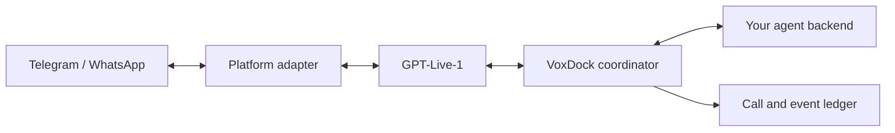

# VoxDock

**Let your agent call you.**

A self-hosted voice bridge for **Telegram**, **WhatsApp**, and **GPT-Live-1**. Connect your agent backend to a phone conversation: deliver an opening message, receive delegated requests, and track the result against the call that produced it.

**Source alpha.** A first WhatsApp call delivered a Chinese opening and a GPT-5.6 Sol answer, but ended unexpectedly with an audio error. A reproducible pacing defect is fixed; handset retesting is pending. Telegram handset calls are unverified. Start with the paused local service. Account-free Linux CI checks the executable service, native binding and actual streaming audio conversion.

## What it does

- One configured operator, one business backend, one active call.
- Fixed call targets, idempotent commands, bounded duration and no automatic redial.
- Continuous audio through GPT-Live-1 with client-managed delegation.
- SQLite call/event records, backend receipts and JSON/HTML audit exports with optional redacted summaries.

Your backend owns task execution, permissions, project routing and long-term memory. VoxDock carries the conversation and its evidence.

## Status

| Area | Implemented | Validation boundary |
| --- | --- | --- |
| Control and records | HTTP contracts, durable admission, recovery and event outbox | Automated tests and a paused ARM64 deployment; real account operations unverified |
| Telegram | MTProto/NTgCalls driver and Live runtime path | Fixtures and account-free native checks; handset calls unverified |
| GPT-Live-1 | Primary WebSocket, PCM, transcripts, client delegation and finite close | Real 16 kHz session, phone greeting and one delegation; interruption and endurance remain unverified |
| WhatsApp | WaCalls control/media, stored identity mapping and shared Live runtime | First outgoing conversation and backend answer heard; pacing fix awaits handset retest |
| Text backend | Optional GPT-5.6 Sol forwarding with durable receipts and callbacks | Offline recovery tests and one real phone delegation completed and heard |
| Packaging | Source install and local Docker/Compose definitions | Linux CI and a paused ARM64 server deployment pass; account restore and real calling remain unverified |

See [acceptance evidence and remaining gates](docs/acceptance.md).

## Start locally

Install Node.js **24** and pnpm **10.17.1**. FFmpeg must be on `PATH` for Telegram audio conversion.

```sh
git clone https://github.com/KineiChou/voxdock.git
cd voxdock
pnpm install --frozen-lockfile
pnpm typecheck
pnpm test
pnpm voxdock init ./local
pnpm voxdock doctor --config ./local/voxdock.config.json
pnpm voxdock serve --config ./local/voxdock.config.json
```

Initialization disables calling and both channels. In another terminal, inspect the service with `pnpm voxdock status --config ./local/voxdock.config.json`. Provisioning a platform session and enabling calling are separate steps in [installation](docs/install.md). `typecheck` validates source; the application runs TypeScript through `tsx`.

## How it fits



Telegram uses teleproto and NTgCalls. WhatsApp uses a separately built WaCalls process with a small server-side PCM patch. Audio stays in bounded memory buffers; it is not written to the call ledger. Transcript retention and backend copies have separate lifetimes.

## Integrate and operate

- [Install, configure and run](docs/install.md)
- [Control API and JSON Schemas](docs/api.md)
- [Backend contract and independent example](docs/backend.md)
- [Platform adapters and native evidence](docs/platforms.md)
- [Live/audio protocol](docs/live.md)
- [WaCalls media patch](docs/wacalls-media.md) and [Node media client](docs/whatsapp-media-client.md)
- [State and recovery](docs/state-and-recovery.md)
- [Engineering decisions](docs/decisions.md) and [contributing](CONTRIBUTING.md)
- [Engineering fixes and verification](docs/engineering-log.md)

The example backend defaults to simulation. Its optional [OpenAI mode](docs/backend.md#openai-text-forwarding) sends delegated text to GPT-5.6 Sol and returns answers to the original call. It does not execute code or external actions. No model-declared success or commentary acknowledgment is treated as proof that an external action succeeded or that speech was heard.

## License

Original VoxDock code is [MIT licensed](LICENSE). NTgCalls, teleproto, WaCalls, FFmpeg and their dependencies retain their own licenses. Read [third-party notices](THIRD_PARTY_NOTICES.md) before distributing binaries or container images. Source licensing does not grant access to platform accounts or APIs. No prebuilt production image or verified phone-call demo is currently provided.
