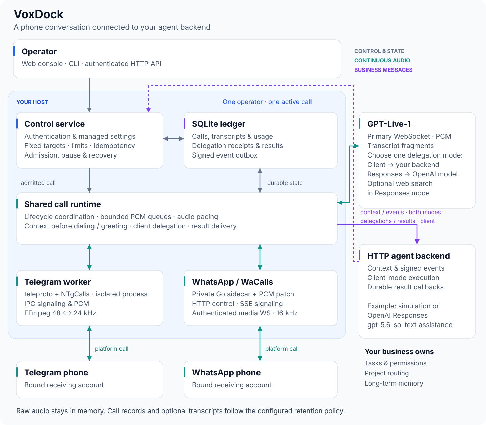

<div align="center">

# VoxDock

**Let your agent call you.**

A self-hosted bridge between your agent backend and voice calls on Telegram and WhatsApp, powered by GPT-Live-1.

[](https://github.com/KineiChou/voxdock/actions/workflows/ci.yml)
[](LICENSE)
[](package.json)

[Get started](#quick-start) · [Documentation](docs/README.md) · [Backend integration](docs/backend.md) · [Known limitations](docs/limitations.md)

</div>

VoxDock gives your backend a voice: call a configured recipient, deliver an opening message, accept requests during the conversation, and return results to the same call. A web console brings account setup, conversation records, usage and settings together. The CLI and HTTP API expose the same backend controls.

> **Experimental software.** WhatsApp has supported a real two-minute Live conversation with a backend answer. Clean handset termination and incoming-call retesting remain open; Telegram account binding and incoming handshakes have been exercised, but handset audio is not yet validated. See [known limitations](docs/limitations.md) before enabling calls.

## What you can do

- **Connect your backend.** Supply fresh call context, receive client-managed delegations and send durable result callbacks, or select OpenAI-managed Responses delegation with optional web search.
- **Talk through either platform.** Telegram uses teleproto and an isolated NTgCalls worker; WhatsApp uses a private WaCalls sidecar. Both share continuous audio and GPT-Live-1.
- **Manage calls from one console.** Link accounts, verify receiving accounts, configure voice and calling limits, and inspect service readiness.
- **Review each conversation.** Browse call states, transcripts, usage and delegation outcomes; export private JSON/HTML records or redacted summaries.
- **Keep control of side effects.** Fixed targets, idempotent requests, one active call, bounded duration and explicit recovery for uncertain outcomes. No automatic redial.

VoxDock serves **one operator and one configured backend**. Your backend owns task execution, permissions, project routing and long-term memory.

## Quick start

Install **Node.js 24** and **pnpm 10.17.1**, then build from source:

```sh
git clone https://github.com/KineiChou/voxdock.git
cd voxdock
pnpm install --frozen-lockfile
pnpm build
pnpm voxdock init ./local
pnpm voxdock doctor --config ./local/voxdock.config.json
pnpm voxdock serve --config ./local/voxdock.config.json
```

The new instance starts with calling and both channels disabled. `doctor` checks local prerequisites without contacting accounts or paid services. In another terminal, inspect the service:

```sh
pnpm voxdock status --config ./local/voxdock.config.json
```

Continue with [installation](docs/install.md) for Docker, platform requirements and persistent storage. To use the web interface, [enable the console](docs/console.md#enable-the-console), open `/console/`, and sign in with the generated private credentials. Then configure Live and your backend, link a calling account, verify a separate receiving account, and enable calling.

Telegram requires FFmpeg on `PATH`. WhatsApp requires the patched WaCalls sidecar on a private network. [Configuration guide](docs/configuration.md) covers voice, Live instructions, delegation modes and backend settings. [Configuration examples](config/) are starting points; keep credentials and account sessions outside version control.

## Architecture



The bridge authenticates requests and records admission before platform side effects. Its runtime owns the call lifecycle, continuous audio and Live session. In client mode, backend work crosses an HTTP contract with durable receipts, signed events and result callbacks; ending a call does not cancel accepted work or trigger a replacement call.

Alternatively, Responses mode delegates directly through OpenAI, with optional web search and model settings. Only one delegation mode runs per session; the HTTP backend still supplies initial business context and receives call events.

Raw audio stays in bounded memory buffers. Call records and optional transcripts use the configured retention policy; exports and backend copies have separate lifetimes. WaCalls remains private because its upstream control API is unauthenticated.

The [example backend](docs/backend.md#independent-example) starts in simulation mode. Optional [OpenAI text forwarding](docs/backend.md#openai-text-forwarding) uses Responses with `gpt-5.6-sol`. It provides text assistance and does not execute tools, code or external actions.

## Documentation

| I want to… | Read |
| --- | --- |
| Install or upgrade an instance | [Installation](docs/install.md) |
| Configure Live and delegation | [Configuration guide](docs/configuration.md) |
| Set up accounts and manage conversations | [Operator console](docs/console.md) |
| Use commands and recover a paused service | [Operations](docs/operations.md) · [State and recovery](docs/state-and-recovery.md) |
| Call VoxDock from an agent | [Control API](docs/api.md) · [Backend contract](docs/backend.md) |
| Understand audio and platform boundaries | [Runtime](docs/runtime.md) · [Live/audio](docs/live.md) · [Platforms](docs/platforms.md) |
| Check supported scope and known issues | [Known limitations](docs/limitations.md) |

Browse the [full documentation index](docs/README.md) for connection protocols and adapter details.

## Contributing

See [CONTRIBUTING.md](CONTRIBUTING.md) for setup, checks and pull requests. Report issues with the source commit, OS/architecture, sanitized `doctor` output and observed call state. Keep credentials, account sessions, QR codes and private conversations out of reports.

## License

Original VoxDock code is [MIT licensed](LICENSE). NTgCalls, teleproto, WaCalls, FFmpeg and their dependencies retain their own licenses; see [third-party notices](THIRD_PARTY_NOTICES.md). Platform account and API access remain subject to their respective requirements. Docker definitions are for local builds; no prebuilt production image is provided.
